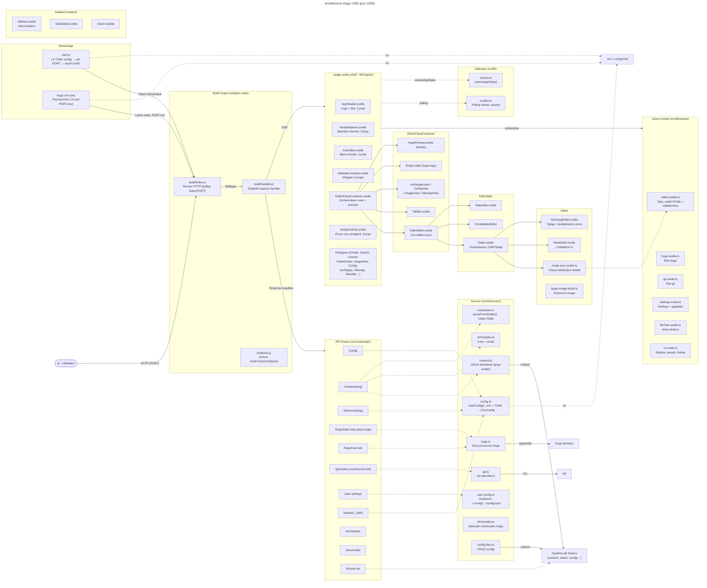
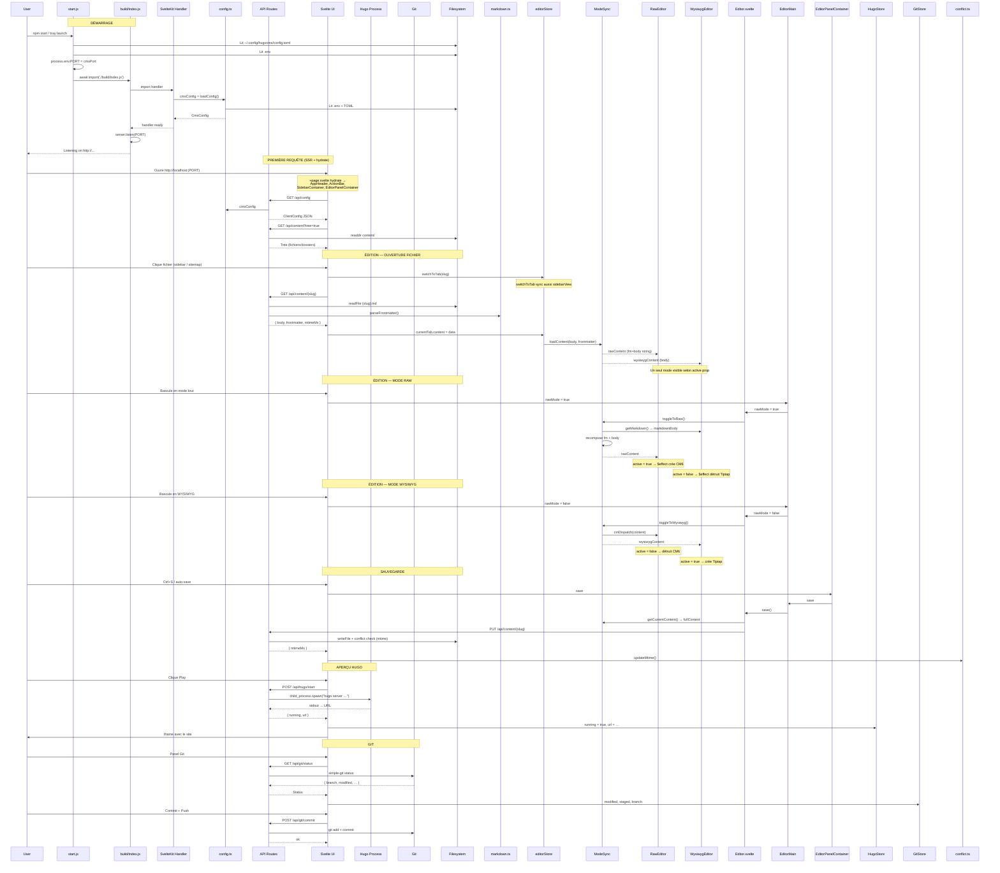

```mermaid
---
title: Architecture Hugo CMS (juin 2026)
---
flowchart LR
  %% === STYLES ===
  classDef person fill:#08427b,color:#fff,stroke:#073b6e,stroke-width:2
  classDef sys fill:#1168bd,color:#fff,stroke:#0e5da8
  classDef ext fill:#999,color:#fff,stroke:#888
  classDef boundary fill:transparent,stroke:#ccc,stroke-dasharray:5 5,color:#eee

  %% === PERSON ===
  user(["&#128100; Utilisateur"])

  %% === EXTERNAL SYSTEMS ===
  fs["Système de fichiers<br/>(content/, static/, config/…)"]
  hugobin["Hugo (binaire)"]
  gitbin["Git"]
  envfile[".env / config.toml"]

  %% === STARTUP ===
  subgraph startup["Démarrage"]
    startjs["start.js<br/><i>Lit TOML config → set PORT → import build</i>"]
    tray["hugo-cms.exe<br/><i>Tray launcher C# (set PORT env)</i>"]
  end

  %% === BUILD OUTPUT ===
  subgraph buildout["Build Output (adapter-node)"]
    idxjs["build/index.js<br/><i>Serveur HTTP (polka), listen(PORT)</i>"]
    handler["build/handler.js<br/><i>SvelteKit request handler</i>"]
    envmod["build/env.js<br/><i>lecture PORT/HOST/ORIGIN</i>"]
  end

  %% === SERVER ===
  subgraph server["Serveur (src/lib/server/)"]
    config["config.ts<br/><i>loadConfig(): .env + TOML → CmsConfig</i>"]
    usercfg["user-config.ts<br/><i>load/save ~/.config/…/config.toml</i>"]
    content["content.ts<br/><i>CRUD Markdown (gray-matter)</i>"]
    markdown["markdown.ts<br/><i>parseFrontmatter(), YAML/TOML</i>"]
    hugo["hugo.ts<br/><i>Gère processus Hugo</i>"]
    git["git.ts<br/><i>Git operations</i>"]
    arch["archetypes.ts<br/><i>Liste + rendu</i>"]
    sc["shortcodes.ts<br/><i>Détection shortcodes Hugo</i>"]
    cf["config-files.ts<br/><i>CRUD config/</i>"]
  end

  %% === API ===
  subgraph apiroutes["API Routes (src/routes/api/)"]
    apicfg["/config"]
    apict["/content/[slug]"]
    apidir["/directory/[slug]"]
    apihugo["/hugo/{start,stop,status,logs}"]
    apinewsite["/hugo/new-site"]
    apigit["/git/{status,commit,push,init}"]
    apiuser["/user-settings"]
    apiassets["/assets/[...path]"]
    apiarch["/archetypes"]
    apisc["/shortcodes"]
    apibrowse["/browse-dir"]
  end

  %% === STORES ===
  subgraph stores["Stores Svelte (src/lib/stores/)"]
    estore["editor.svelte.ts<br/><i>Tabs, switchToTab + sidebarView</i>"]
    hstore["hugo.svelte.ts<br/><i>État Hugo</i>"]
    gstore["git.svelte.ts<br/><i>État git</i>"]
    sstore["settings.svelte.ts<br/><i>Settings + appState</i>"]
    ftstore["fileTree.svelte.ts<br/><i>Arbre fichiers</i>"]
    ustore["ui.svelte.ts<br/><i>Sidebar, panels, thème</i>"]
  end

  %% === VIEW LAYER (composants + editor/) ===
  subgraph shell["+page.svelte (shell ~364 lignes)"]
    apphdr["AppHeader.svelte<br/><i>Logo + titre, 0 prop</i>"]
    rstbanner["RestartBanner.svelte<br/><i>Bannière chemin, 0 prop</i>"]
    actionbar["ActionBar.svelte<br/><i>Barre d'outils, 0 prop</i>"]
    sidebarcont["SidebarContainer.svelte<br/><i>Wrapper 5 props</i>"]
    editorpanel["EditorPanelContainer.svelte<br/><i>Orchestrateur vues + preview</i>"]
    setupov["SetupOverlay.svelte<br/><i>Écran non-configuré, 0 prop</i>"]
    dialogs["Dialogues (Create, Search, Commit,<br/>FolderPicker, ImageView, Config,<br/>Archetype, Sitemap, NewSite…)"]
  end

  subgraph sidebarcont_inner["SidebarContainer"]
    sidebarsub["Sidebar.svelte<br/><i>Arbre fichiers</i>"]
    gitsidebar["GitSidebar.svelte"]
    resizeh["resize-handle"]
  end

  subgraph editorpanel_inner["EditorPanelContainer"]
    tabbar["TabBar.svelte"]
    editormain["EditorMain.svelte<br/><i>Vue éditeur pure</i>"]
    archview["ArchetypeView / ConfigView<br/>/ ImageView / SitemapView"]
    emptystate["Empty state (hugo-logo)"]
    hugoprev["HugoPreview.svelte (iframe)"]
  end

  subgraph editormain_inner["EditorMain"]
    editor["Editor.svelte<br/><i>Orchestrateur CM6/Tiptap</i>"]
    fmeditor["FrontMatterEditor"]
    statusbar["StatusBar.svelte"]
  end

  subgraph editor_inner["Editor"]
    raww["RawEditor.svelte<br/><i>CodeMirror 6</i>"]
    wysi["WysiwygEditor.svelte<br/><i>Tiptap + bubble/slash menu</i>"]
    msync["mode-sync.svelte.ts<br/><i>Classe ModeSync $state</i>"]
    imgblock["tiptap-image-block.ts<br/><i>Extension Image</i>"]
  end

  %% === CONFLICT DETECTION ===
  subgraph conflict["Détection conflits"]
    conflictmod["conflict.ts<br/><i>Polling mtime, resolve</i>"]
    restorem["restore.ts<br/><i>restoreAppState()</i>"]
  end

  %% ========== RELATIONS ==========

  user -->|"HTTP (PORT)"| idxjs
  startjs -->|"Import dynamique"| idxjs
  startjs -..->|"Lit"| envfile
  tray -->|"Lance node, PORT env"| idxjs
  tray -..->|"Lit"| envfile

  idxjs -->|"Délègue"| handler
  handler -->|"Route les requêtes"| apiroutes
  handler -->|"SSR"| shell

  apicfg -..-> config
  apict -..-> content
  apict -..-> arch
  apict -..-> markdown
  apidir -..-> config
  apihugo -..-> hugo
  apinewsite -..-> hugo
  apigit -..-> git
  apiuser -..-> usercfg
  apiassets -..-> config
  apibrowse -..-> fs

  content -->|"Lit/écrit"| fs
  hugo -->|"spawn/kill"| hugobin
  git -->|"CLI"| gitbin
  config -..->|"Lit"| envfile
  cf -->|"Lit/écrit"| fs

  shell -->|"consomme"| stores
  shell -..->|"polling"| conflictmod
  shell -..->|"restoreAppState"| restorem

  editorpanel --> editormain
  editorpanel --> tabbar
  editorpanel --> archview
  editorpanel --> emptystate
  editorpanel --> hugoprev

  editormain --> editor
  editormain --> fmeditor
  editormain --> statusbar

  editor --> msync
  editor --> raww
  editor --> wysi

  msync -..-> estore
```

```mermaid
sequenceDiagram
    participant U as User
    participant S as start.js
    participant B as build/index.js
    participant H as SvelteKit Handler
    participant C as config.ts
    participant A as API Routes
    participant UI as Svelte UI
    participant HUGO as Hugo Process
    participant GIT as Git
    participant FS as Filesystem
    participant markdown as markdown.ts
    participant editorStore as editorStore
    participant modeSync as ModeSync
    participant rawEditor as RawEditor
    participant wysiwygEditor as WysiwygEditor
    participant Editor as Editor.svelte
    participant EditorMain as EditorMain
    participant EditorPanel as EditorPanelContainer
    participant hugoStore as HugoStore
    participant gitStore as GitStore
    participant conflictMod as conflict.ts

    Note over S,B: DÉMARRAGE
    U->>S: npm start / tray launch
    S->>FS: Lit ~/.config/hugocms/config.toml
    S->>FS: Lit .env
    S->>S: process.env.PORT = cmsPort
    S->>B: await import('./build/index.js')
    B->>H: import handler
    H->>C: cmsConfig = loadConfig()
    C->>FS: Lit .env + TOML
    C-->>H: CmsConfig
    H-->>B: handler ready
    B->>B: server.listen(PORT)
    B-->>U: Listening on http://...

    Note over UI,A: PREMIÈRE REQUÊTE (SSR + hydrate)
    U->>UI: Ouvre http://localhost:{PORT}
    Note over UI: +page.svelte hydrate →<br/>AppHeader, ActionBar,<br/>SidebarContainer, EditorPanelContainer
    UI->>A: GET /api/config
    A->>C: cmsConfig
    A-->>UI: ClientConfig JSON
    UI->>A: GET /api/content?tree=true
    A->>FS: readdir content/
    A-->>UI: Tree (fichiers/dossiers)

    Note over UI,FS: ÉDITION — OUVERTURE FICHIER
    U->>UI: Clique fichier (sidebar / sitemap)
    UI->>editorStore: switchToTab(slug)
    Note over editorStore: switchToTab sync aussi sidebarView
    UI->>A: GET /api/content/{slug}
    A->>FS: readFile {slug}.md
    A->>markdown: parseFrontmatter()
    A-->>UI: { body, frontmatter, mtimeMs }
    UI->>editorStore: currentTab.content = data
    editorStore->>modeSync: loadContent(body, frontmatter)
    modeSync-->>rawEditor: rawContent (fm+body string)
    modeSync-->>wysiwygEditor: wysiwygContent (body)
    Note over rawEditor,wysiwygEditor: Un seul mode visible selon active prop

    Note over UI,FS: ÉDITION — MODE RAW
    U->>UI: Bascule en mode brut
    UI->>EditorMain: rawMode = true
    EditorMain->>Editor: rawMode = true
    Editor->>modeSync: toggleToRaw()
    modeSync->>wysiwygEditor: getMarkdown() → markdownBody
    modeSync->>modeSync: recompose fm + body
    modeSync-->>rawEditor: rawContent
    Note over rawEditor: active = true → $effect crée CM6
    Note over wysiwygEditor: active = false → $effect détruit Tiptap

    Note over UI,FS: ÉDITION — MODE WYSIWYG
    U->>UI: Bascule en WYSIWYG
    UI->>EditorMain: rawMode = false
    EditorMain->>Editor: rawMode = false
    Editor->>modeSync: toggleToWysiwyg()
    modeSync->>rawEditor: cmDispatch(content)
    modeSync-->>wysiwygEditor: wysiwygContent
    Note over rawEditor: active = false → détruit CM6
    Note over wysiwygEditor: active = true → crée Tiptap

    Note over UI,FS: SAUVEGARDE
    U->>UI: Ctrl+S / auto-save
    UI->>EditorPanel: save
    EditorPanel->>EditorMain: save
    EditorMain->>Editor: save()
    Editor->>modeSync: getCurrentContent() → fullContent
    Editor->>A: PUT /api/content/{slug}
    A->>FS: writeFile + conflict check (mtime)
    A-->>UI: { mtimeMs }
    UI->>conflictMod: updateMtime()

    Note over UI,HUGO: APERÇU HUGO
    U->>UI: Clique Play
    UI->>A: POST /api/hugo/start
    A->>HUGO: child_process.spawn("hugo server …")
    HUGO-->>A: stdout → URL
    A-->>UI: { running, url }
    UI->>hugoStore: running = true, url = …
    UI->>U: Iframe avec le site

    Note over UI,GIT: GIT
    U->>UI: Panel Git
    UI->>A: GET /api/git/status
    A->>GIT: simple-git status
    GIT-->>A: { branch, modified, … }
    A-->>UI: Status
    UI->>gitStore: modified, staged, branch
    U->>UI: Commit + Push
    UI->>A: POST /api/git/commit
    A->>GIT: git add + commit
    A-->>UI: ok
```

```mermaid
flowchart TD
    subgraph "Build & Deploy"
        DPS1["dist.ps1"] --> ESB["esbuild build/index.js → bundle.mjs"]
        DPS1 --> CSC["csc → hugo-cms.exe (tray-launcher.cs)"]
        DPS1 --> CP["copy build/client/ → dist/client/"]
        CSC --> TRAY["hugo-cms.exe"]
        TRAY -->|"set PORT env"| NODE["node bundle.mjs"]
    end

    subgraph "Entry Points"
        STARTJS["start.js"] -->|"Lit TOML + .env, set PORT"| IDXJS["build/index.js"]
        TRAY2["hugo-cms.exe"] -->|"Lit config.toml, set PORT env"| IDXJS
        IDXJS -->|"server.listen(PORT)"| HTTP["HTTP Server (polka)"]
    end

    subgraph "Server Core (src/lib/server/)"
        CONFIG["config.ts"] -->|"loadConfig"| ENV[".env"]
        CONFIG -->|"loadUserSettings"| TOML["~/.config/hugocms/config.toml"]
        CONFIG --> HUGO["hugo.ts"]
        CONFIG --> GIT["git.ts"]
        CONFIG --> CONTENT["content.ts"]
        CONFIG --> ARCH["archetypes.ts"]
        CONFIG --> SHORT["shortcodes.ts"]
        CONFIG --> CF["config-files.ts"]
        CONTENT --> MD["markdown.ts"]
        CONFIG --> UC["user-config.ts"]
    end

    subgraph "API Routes (src/routes/api/)"
        ACONF["/config"] --> CONFIG
        ACT["/content/[slug]"] --> CONTENT
        ACT --> ARCH
        ADIR["/directory/[slug]"] --> CONTENT
        AHUGO["/hugo/{start,stop,status,logs}"] --> HUGO
        AHUGO_NEW["/hugo/new-site"] --> HUGO
        AGIT["/git/{status,commit,push,init,reset}"] --> GIT
        AUSER["/user-settings"] --> UC
        AASSETS["/assets/[...path]"] --> FS_STATIC["static/"]
        AARCH["/archetypes"] --> ARCH
        ASC["/shortcodes"] --> SHORT
        ABROWSE["/browse-dir"] --> FS_CONTENT
    end

    subgraph "Stores Svelte (src/lib/stores/)"
        ESTORE["editor.svelte.ts"]
        HSTORE["hugo.svelte.ts"]
        GSTORE["git.svelte.ts"]
        SSTORE["settings.svelte.ts"]
        FTSTORE["fileTree.svelte.ts"]
        USTORE["ui.svelte.ts"]
    end

    subgraph "Composants UI (src/lib/components/)"
        PAGE["+page.svelte (~364 lignes, shell)"]
        PAGE --> APPHEADER["AppHeader.svelte (0 prop)"]
        PAGE --> RESTARTB["RestartBanner.svelte (0 prop)"]
        PAGE --> ACTIONBAR["ActionBar.svelte (0 prop)"]
        PAGE --> SIDEBARCT["SidebarContainer.svelte (5 props)"]
        PAGE --> EPANEL["EditorPanelContainer.svelte (1 prop)"]
        PAGE --> SETUP["SetupOverlay.svelte (0 prop)"]
        PAGE --> FF["conflict.ts (polling mtime)"]
        PAGE --> RESTORE["restore.ts (restoreAppState)"]
        PAGE --> SETTINGS["SettingsDialog.svelte"]
        PAGE --> HUGOCON["HugoConsole.svelte"]
        PAGE --> DIALOGS["CreateFile / CreateFolder / Search / Shortcuts / Commit / FolderPicker / ImageView / NewSiteDialog / ShortcodeDialog"]

        SIDEBARCT --> SIDEBAR["Sidebar.svelte"]
        SIDEBARCT --> GITSIDEBAR["GitSidebar.svelte"]

        EPANEL --> TABBAR["TabBar.svelte"]
        EPANEL --> HUGOPREV["HugoPreview.svelte"]
        EPANEL --> EMAIN["EditorMain.svelte"]
        EPANEL --> ARCHCFG["ArchetypeView / ConfigView / ImageView / SitemapView"]

        EMAIN --> EDITOR["Editor.svelte (CM6/Tiptap)"]
        EMAIN --> FM["FrontMatterEditor.svelte"]
        EMAIN --> STATUSBAR["StatusBar.svelte"]
    end

    subgraph "Éditeur interne (src/lib/components/ + editor/)"
        EDITOR --> MSYNC["mode-sync.svelte.ts (ModeSync)"]
        EDITOR --> RAW["RawEditor.svelte (CodeMirror 6)"]
        EDITOR --> WYSI["WysiwygEditor.svelte (Tiptap)"]
        RAW --> CM6["EditorView CM6"]
        WYSI --> TIPTAP["Editor Tiptap"]
        WYSI --> BUBBLE["BubbleMenu.svelte"]
        WYSI --> SLASH["slash-commands.ts"]
        WYSI -.-> IMGBLOCK["tiptap-image-block.ts"]
    end

    subgraph "External Systems"
        FS_CONTENT["content/"]
        FS_STATIC
        FS_CONFIG["config/"]
        HUGO_BIN["Hugo Server"]
        GIT_BIN["Git (simple-git)"]
    end

    CONFIG -->|"hugoContentDir"| FS_CONTENT
    CONTENT --> FS_CONTENT
    ARCH --> FS_CONTENT
    HUGO --> HUGO_BIN
    GIT --> GIT_BIN
    CF --> FS_CONFIG
    ABROWSE --> FS_CONTENT

    PAGE -->|"consomme"| ESTORE
    PAGE -->|"consomme"| HSTORE
    PAGE -->|"consomme"| GSTORE
    PAGE -->|"consomme"| SSTORE
    PAGE -->|"consomme"| FTSTORE
    PAGE -->|"consomme"| USTORE

    HTTP -.->|"Requêtes HTTP"| PAGE
```
