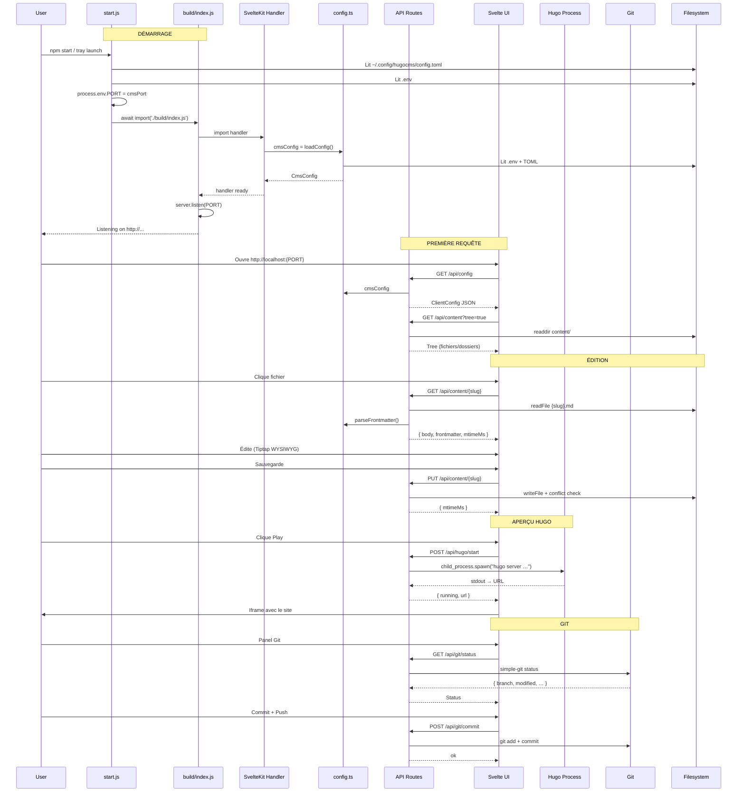

```mermaid
---
title: Architecture Hugo CMS
---
C4Context
  Person(user, "Utilisateur", "Éditeur de contenu via navigateur")

  System_Boundary(cms, "Hugo CMS (SvelteKit + adapter-node)") {
    Boundary(startup, "Démarrage") {
      System_Ext(startjs, "start.js", "Lit TOML config → set PORT → import build")
      System_Ext(tray, "hugo-cms.exe", "Tray launcher C# (set PORT env, console fenêtrée)")
    }

    Boundary(build, "Build Output (adapter-node)") {
      System_Ext(idxjs, "build/index.js", "Serveur HTTP (polka), listen(PORT)")
      System_Ext(handler, "build/handler.js", "SvelteKit request handler")
      System_Ext(envjs, "build/env.js", "env() lecture PORT/HOST/ORIGIN…")
    }

    Boundary(server, "Serveur (src/lib/server/)") {
      System_Ext(config, "config.ts", "loadConfig(): .env + TOML → CmsConfig")
      System_Ext(usercfg, "user-config.ts", "load/save ~/.config/hugocms/config.toml")
      System_Ext(content, "content.ts", "CRUD fichiers Markdown (gray-matter)")
      System_Ext(markdown, "markdown.ts", "parseFrontmatter(), détection YAML/TOML")
      System_Ext(hugo, "hugo.ts", "Gère processus Hugo (spawn/kill/poll)")
      System_Ext(git, "git.ts", "Git operations (status/commit/push/init)")
      System_Ext(arch, "archetypes.ts", "Liste + rendu d'archétypes (template)")
      System_Ext(sc, "shortcodes.ts", "Détection et liste shortcodes Hugo")
      System_Ext(cf, "config-files.ts", "CRUD fichiers config/ (hugo.toml…)")
    }

    Boundary(api, "API Routes (src/routes/api/)") {
      System_Ext(apicfg, "api/config", "GET → config sérialisée (tree)")
      System_Ext(apict, "api/content/[slug]", "GET/POST/PUT/DELETE/PATCH content")
      System_Ext(apidir, "api/directory/[slug]", "POST/DELETE dossiers")
      System_Ext(apihugo, "api/hugo/{start,stop,status,logs}", "Contrôle Hugo serveur")
      System_Ext(apigit, "api/git/{status,commit,push,init}", "Opérations Git")
      System_Ext(apiuser, "api/user-settings", "GET/PUT settings depuis TOML")
      System_Ext(apiassets, "api/assets/[...path]", "Serve fichiers static/")
      System_Ext(apiarch, "api/archetypes", "Liste archétypes")
      System_Ext(apisc, "api/shortcodes", "Liste shortcodes")
      System_Ext(apibrowse, "api/browse-dir", "Navigation dossier (folder picker)")
    }

    Boundary(ui, "UI Svelte (src/routes/ + src/lib/)") {
      System_Ext(page, "+page.svelte", "App shell, layout, orchestrateur")
      System_Ext(sidebar, "Sidebar.svelte", "Arbre fichiers/static/arch/config")
      System_Ext(editor, "Editor.svelte", "Tiptap (WYSIWYG) + raw mode")
      System_Ext(fmeditor, "FrontMatterEditor", "Édition YAML/TOML formulaire ou raw")
      System_Ext(tabbar, "TabBar.svelte", "Onglets fichiers ouverts")
      System_Ext(statusbar, "StatusBar.svelte", "Mots/caractères, aide")
      System_Ext(settings, "SettingsDialog.svelte", "Tous les paramètres utilisateur")
      System_Ext(gitpanel, "GitSidebar.svelte", "Status/commit/push Git")
      System_Ext(hugoprev, "HugoPreview.svelte", "Iframe aperçu site")
      System_Ext(hugoconsole, "HugoConsole.svelte", "Logs Hugo en direct")
      System_Ext(other, "Dialogues…", "CreateFile, CreateFolder, Search, Shortcuts, Commit, FolderPicker, ImageView, ArchetypeView, ConfigView, ShortcodeDialog, SitemapView")
    }
  }

  System_Ext(fs, "Système de fichiers", "content/, static/, config/…")
  System_Ext(hugobin, "Hugo (binaire)", "hugo server, archetypes")
  System_Ext(gitbin, "Git", "status/commit/push")
  System_Ext(envfile, ".env / config.toml", "Configuration persistante")

  Rel(user, idxjs, "Navigue sur", "HTTP (PORT)")
  Rel(idxjs, handler, "Délègue les requêtes")
  Rel(startjs, idxjs, "Import dynamique + set PORT")
  Rel(startjs, envfile, "Lit .env + config.toml")
  Rel(tray, idxjs, "Lance node", "PORT env var")
  Rel(tray, envfile, "Lit config.toml")

  Rel(handler, api, "Route les requêtes API")
  Rel(handler, page, "SSR de l'UI Svelte")

  Rel(apicfg, config, "cmsConfig")
  Rel(apict, content, "CRUD")
  Rel(apict, arch, "Archetype rendering")
  Rel(apict, markdown, "parseFrontmatter")
  Rel(apidir, config, "trashDir")
  Rel(apihugo, hugo, "Démarrage/arrêt/status")
  Rel(apigit, git, "Git operations")
  Rel(apiuser, usercfg, "load/save")
  Rel(apiassets, config, "hugoStaticPath")

  Rel(content, fs, "Lit/écrit", "content/")
  Rel(hugo, hugobin, "spawn/kill", "hugo server")
  Rel(git, gitbin, "CLI", "git")
  Rel(config, envfile, "Lit", ".env + config.toml")
  Rel(cf, fs, "Lit/écrit", "config/")
```

```mermaid
flowchart TD
    subgraph "Build & Deploy"
        DPS1["dist.ps1"] --> ESB["esbuild build/index.js → bundle.mjs"]
        DPS1 --> CSC["csc → hugo-cms.exe"]
        DPS1 --> CP["copy build/client/"]
        CSC --> TRAY["tray-launcher.cs"]
        TRAY -->|"psi.EnvironmentVariables[PORT]"| NODE["node bundle.mjs"]
    end

    subgraph "Entry Points"
        STARTJS["start.js"] -->|"Lit TOML + .env, set PORT"| IDXJS["build/index.js"]
        TRAY2["hugo-cms.exe"] -->|"Lit config.toml, set PORT env"| IDXJS
        IDXJS -->|"server.listen(PORT)"| HTTP["HTTP Server (polka)"]
    end

    subgraph "Server Core (src/lib/server/)"
        CONFIG["config.ts"] -->|"loadConfig"| ENV[".env"]
        CONFIG -->|"loadUserSettings"| TOML["~/.config/hugocms/config.toml"]
        CONFIG --> HUGO["hugo.ts"]
        CONFIG --> GIT["git.ts"]
        CONFIG --> CONTENT["content.ts"]
        CONFIG --> ARCH["archetypes.ts"]
        CONFIG --> SHORT["shortcodes.ts"]
        CONFIG --> CF["config-files.ts"]
        CONTENT --> MD["markdown.ts"]
    end

    subgraph "API Routes (src/routes/api/)"
        ACONF["/config"] --> CONFIG
        ACT["/content/[slug]"] --> CONTENT
        ACT --> ARCH
        ADIR["/directory/[slug]"] --> CONTENT
        AHUGO["/hugo/{start,stop,status,logs}"] --> HUGO
        AGIT["/git/{status,commit,push,init}"] --> GIT
        AUSER["/user-settings"] --> TOML
        AASSETS["/assets/[...path]"] --> FS_STATIC["static/"]
        AARCH["/archetypes"] --> ARCH
        ASC["/shortcodes"] --> SHORT
    end

    subgraph "UI Components (Svelte)"
        PAGE["+page.svelte"]
        PAGE --> SIDEBAR["Sidebar.svelte"]
        PAGE --> TABBAR["TabBar.svelte"]
        PAGE --> EDITOR["Editor.svelte (Tiptap)"]
        PAGE --> FM["FrontMatterEditor.svelte"]
        PAGE --> STATUSBAR["StatusBar.svelte"]
        PAGE --> SETTINGS["SettingsDialog.svelte"]
        PAGE --> HUGOPREV["HugoPreview.svelte (iframe)"]
        PAGE --> HUGOCON["HugoConsole.svelte"]
        PAGE --> GITSIDEBAR["GitSidebar.svelte"]
        PAGE --> DIALOGS["CreateFile / CreateFolder / Search / Commit / Shortcuts / FolderPicker / ImageView / ArchetypeView / ConfigView / SitemapView / ShortcodeDialog"]
    end

    subgraph "Settings System"
        SCHEMA["schema.ts"] -->|"Définit les champs + validation"| SETTINGSPANEL["SettingsPanel.svelte"]
        SETTINGSPANEL --> SETTINGFIELD["SettingField.svelte"]
        SETTINGS --> SETTINGSPANEL
        SETTINGS -->|"saveUserSettings()"| TOML
        PAGE -->|"saveAppState()"| TOML
        PAGE -->|"loadUserSettings()"| TOML
    end

    subgraph "External Systems"
        FS_CONTENT["content/ (fichiers .md)"]
        FS_STATIC
        FS_CONFIG["config/"]
        HUGO_BIN["Hugo Server (localhost:1313)"]
        GIT_BIN["Git (simple-git)"]
    end

    CONFIG -->|"configPath"| FS_CONTENT
    CONTENT --> FS_CONTENT
    ARCH --> FS_CONTENT
    HUGO --> HUGO_BIN
    GIT --> GIT_BIN
    CF --> FS_CONFIG

    HTTP -.->|"Requêtes HTTP"| PAGE
```




