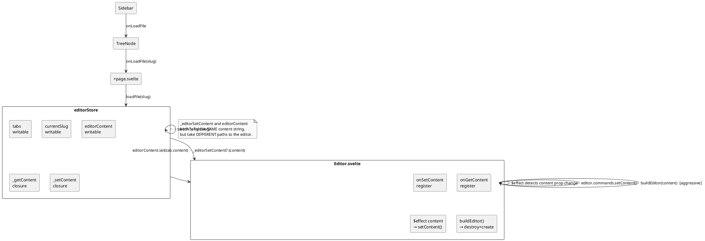
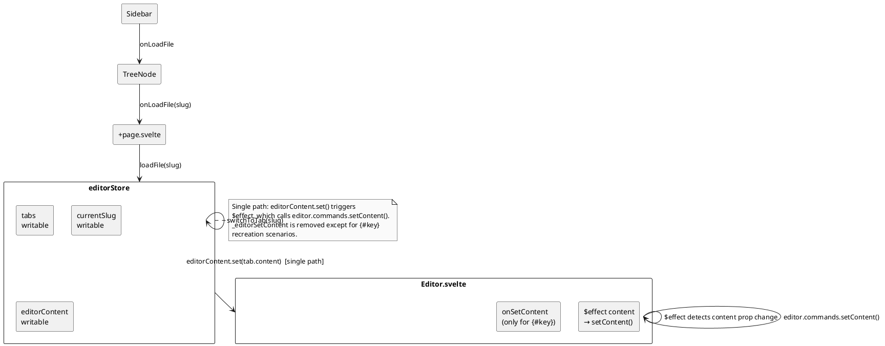

# Editor Dataflow

## Problem

When the user clicks a content file in the sidebar, the editor textarea must
update to show that file's content. This document traces the complete dataflow
from click to rendered content, documents the *as-is* architecture, and
identifies the gap with the *to-be* design.

---

## Overview

```
Sidebar click  →  +page.svelte  →  editorStore  →  Editor.svelte  →  Tiptap / CM6
      │               │               │                  │
      │   onLoadFile  │   loadFile /  │   content prop   │
      └───────────────┘   switchToTab └──────────────────┘
                          
                          _editorSetContent callback ────┘
```

Two parallel content-update paths exist — the **store-prop** path (Svelte
reactive) and the **callback** path (imperative). They are redundant.

---

## Responsibilities

| Layer | Role |
|-------|------|
| `Sidebar.svelte` | Renders file tree, delegates click handling via `onLoadFile` prop |
| `TreeNode.svelte` | Calls `onLoadFile(slug)` on file click |
| `+page.svelte` | Wires callbacks, owns `loadFile()` and `switchToTab()` wrappers |
| `editorStore` | Holds all tab state, persists tabs, manages lifetime |
| `Editor.svelte` | Renders Tiptap (WYSIWYG) or CodeMirror 6 (raw) depending on mode |
| `_editorGetContent` | Closure: reads current editor content (owner: Editor.svelte) |
| `_editorSetContent` | Closure: writes content to editor (owner: Editor.svelte) |

---

## Dataflow: Sidebar click → Editor update

### Step 1: Sidebar click

`TreeNode.svelte` (line ~60):
```ts
function handleClick() {
    if (node.type === 'file') onLoadFile?.(node.slug);
}
```

### Step 2: +page.svelte — loadFile()

```ts
async function loadFile(slug: string) {
    await editorStore.loadFile(slug, loadTree);
    if ($currentSlug === slug) {
        settingsStore.updateLayout({ sidebarView: 'content' });
    }
}
```

### Step 3: editorStore.loadFile()

```
┌─ Tab already open? ──→ switchToTab(slug)
│
└─ New tab ──→ fetch /api/content/{slug}
               → create Tab object
               → tabs.update([...t, tab])
               → switchToTab(slug)
```

### Step 4: editorStore.switchToTab()

```
1. get(tabs) snapshot
2. Find target Tab by slug
3. If _editorGetContent registered:
   - Capture current editor content via _editorGetContent()
   - Capture current frontmatter via get(currentFrontmatter)
   - tabs.update: spread-copy old tab with saved content/frontmatter
4. Set currentSlug.set(tab.slug)
5. Set editorContent.set(tab.content)           ← triggers Svelte re-render
6. Set currentFrontmatter, currentFmFormat
7. Call _editorSetContent?.(tab.content)         ← direct update to DOM editor
```

### Step 5: Editor.svelte — content reception

**Path A — $effect on `content` prop** (lines 279-291):
```ts
$effect(() => {
    if (content === prevContent) return;
    prevContent = content;
    if (rawMode) {
        // Merge frontmatter + body → rawContent
    } else if (editor) {
        editor.commands.setContent(protectShortcodes(content));
    }
});
```

**Path B — `_editorSetContent` callback** (lines 257-263):
```ts
onSetContent?.((c: string) => {
    if (rawMode) {
        rawContent = c;
    } else {
        buildEditor(c);  // Destroys & recreates Tiptap!
    }
});
```

---

## The Two-Update Problem (fixed)

**`_editorSetContent` has been removed from `switchToTab`, `handleCloseTab`, and
`reloadFileFromDisk`.** Only the store-prop path (`editorContent.set()` →
`$effect` → `editor.commands.setContent()`) is used for normal tab switches.

The `_editorSetContent` infrastructure (setter + registration) is preserved but
no longer called from store methods. It remains as a safety net for `{#key}`
recreation scenarios where a Tiptap instance is rebuilt from scratch.

### When `_editorSetContent` is still needed

- After `{#key}` recreation of EditorComp (`settingsKey++` in
  `+page.svelte:717`) — but even this case is handled by the prop flow
  (new Editor reads `content` prop in `onMount` → `buildEditor(content)`).
  The callback is kept purely as defense-in-depth.

---

## Timing / Race Conditions

### Lazy mount timing (verified ✅)

Question: when `switchToTab` fires `editorContent.set()` *before* Editor.svelte
mounts (lazy import not yet resolved), is content lost?

**Trace:**

```
1. sidebar click → switchToTab(slug) → editorContent.set(tab.content)
2. later → import('Editor.svelte') resolves → EditorComp = m.default
3. Svelte flushes → Editor.svelte mounts with content={$editorContent}
   → $props() destructures content = latest $editorContent value  ✅
4. Editor.onMount fires:
   a. buildEditor(content) — creates Tiptap with the current prop   ✅
   b. prevContent = content — records for $effect guard
5. $effect(content) fires after onMount:
   → content === prevContent → true → returns early                  ✅
```

**Conclusion: no content is lost.** The `content` prop is reactive and receives
the already-set value from step 1. `buildEditor(content)` in `onMount`
initializes with the correct content. The `$effect` correctly skips because
`prevContent` was set in `onMount`.

This holds for all sub-scenarios:
- 🔄 **Rapid switching** (click A, then B, then Editor mounts): Editor sees the
  *last* `editorContent.set()` value → correct.
- 📋 **Restore state** (`restoreAppState` → `switchToTab(activeSlug)` before
  Editor mount): same flow — Editor.onMount reads the current prop.
- 🔄 **Already mounted** (subsequent sidebar clicks): `editorContent.set()`
  changes the prop → `$effect` detects `content !== prevContent` →
  `editor.commands.setContent(content)` updates Tiptap in place. ✅

### Possible bug: stale `tab.content` after tabs.update()

In `switchToTab`, at step 4:
```ts
currentSlug.set(tab.slug);
editorContent.set(tab.content);  // tab from snapshot at step 1
```

After `tabs.update()` at step 3 (which creates a new array for tabs store),
`tab` still points to the old object. If `tab` was updated by `tabs.update`
(which happens when `slug === curSlug`, i.e., clicking the already-active tab),
`tab.content` is stale.

For clicking a **different** tab (`slug !== curSlug`), `tabs.update` updates the
*old* tab, not the target. So `tab.content` is correct.

---

## Invariants

1. **Tab.content is the canonical server-truth**, updated only from API
   responses (`loadFile`, `reloadFileFromDisk`) or from the editor via
   `switchToTab` save-step.

2. **`_editorGetContent` / `_editorSetContent` are nullable** — always guard
   with `?.`. They may be null during Editor mount. Note: `_editorSetContent` is
   no longer called from store methods; it exists as infrastructure only.

3. **`editorContent` store is the sole content-update path** — `editorContent.set()`
   changes the `content` prop, which the `$effect` detects to call
   `editor.commands.setContent()`. The callback path (`_editorSetContent`) is
   unused in normal flow.

4. **`rawMode` controls which editor is visible** — Tiptap (`editor-content`)
   vs. CM6 (`cm-editor-host`). Only one is active at a time.

5. **CM6 content sync is uni-directional**: changes in CM6 flow to `rawContent`
   state → `onSave`, but `rawContent` changes from outside flow back to CM6 via
   the sync `$effect` at line 395.

---

## Boundaries

### What this system intentionally does NOT handle

- **Concurrent edits from multiple browser tabs** — conflict detection exists
  (409 response) but no real-time sync.

- **Collaborative editing** — no OT/CRDT.

- **File-system polling** — external changes are detected only via
  `reloadFileFromDisk` called from the conflict polling loop.

---

## Failure Modes

| Symptom | Likely Cause | Mitigation |
|---------|-------------|------------|
| Editor blank after sidebar click | `$effect` skipped because prop didn't change (stale `prevContent`) | ✅ Not a real issue — `onMount` reads latest prop directly via `buildEditor(content)`. No `$effect` guard needed. |
| Tab switch loses undo history | ~~`buildEditor()` destroys Tiptap~~ | ✅ Fixed — `_editorSetContent` removed from store methods |
| Double content flash | ~~Both `$effect` and `buildEditor()` update in same microtask~~ | ✅ Fixed — single path now |
| CM6 content out of sync | `cmUpdating` guard skips external sync during user edit | Debounce or queue, don't skip |

---

## Current Architecture (as-is)



## Target Architecture (to-be)



---

## Key Differences as-is → to-be

| Aspect | As-is | To-be |
|--------|-------|-------|
| Content update paths | 2 (store path + callback path) | 1 (store path only) |
| Tab switch editor update | `$effect` + `buildEditor()` | `$effect` only |
| Tiptap lifecycle | Destroyed on every tab switch (via `buildEditor`) | Preserved across tab switches |
| `_editorSetContent` | Used for EVERY content push | Used ONLY for `{#key}` recreation |
| Undo history | Lost on every tab switch | Preserved |

---

## Recommendations

1. ~~**Remove `_editorSetContent` from `switchToTab`**~~ ✅ Done — also removed
   from `handleCloseTab` and `reloadFileFromDisk`. Only the `$effect` on
   `content` prop drives editor updates now.

2. ✅ **Verified: `$effect` on lazy mount is safe** — `buildEditor(content)` in
   `onMount` reads the latest `content` prop directly (see "Lazy mount timing"
   above). No additional guard needed.

3. **Consider a `switchToTab` guard** — if `slug === get(currentSlug)`, skip the
   content update entirely (no-op).

4. **Document the `cmUpdating` flag semantics** in CM6 sync — currently it
   blocks external sync during user edits, which can drop updates.

---

## File Map

| File | Lines of Interest |
|------|-------------------|
| `src/lib/stores/editor.svelte.ts` | `loadFile` (83-105), `switchToTab` (123-149), `handleSave` (151-175), `handleCloseTab` (177-202), `reloadFileFromDisk` (304-324) |
| `src/lib/components/Editor.svelte` | `_editorSetContent` registration (257-263), `content` $effect (279-291), `buildEditor` (192-241), CM6 lifecycle (355-405), CM6 sync (395-405) |
| `src/routes/+page.svelte` | `loadFile` (193-198), `switchToTab` local wrapper (199-210), EditorComp props (583-603), `settingsKey` mechanism (714-718) |
| `src/lib/components/Sidebar.svelte` | `onLoadFile` plumbing (23, 115) |
| `src/lib/components/TreeNode.svelte` | `handleClick` (~60), `onLoadFile?.(slug)` |
