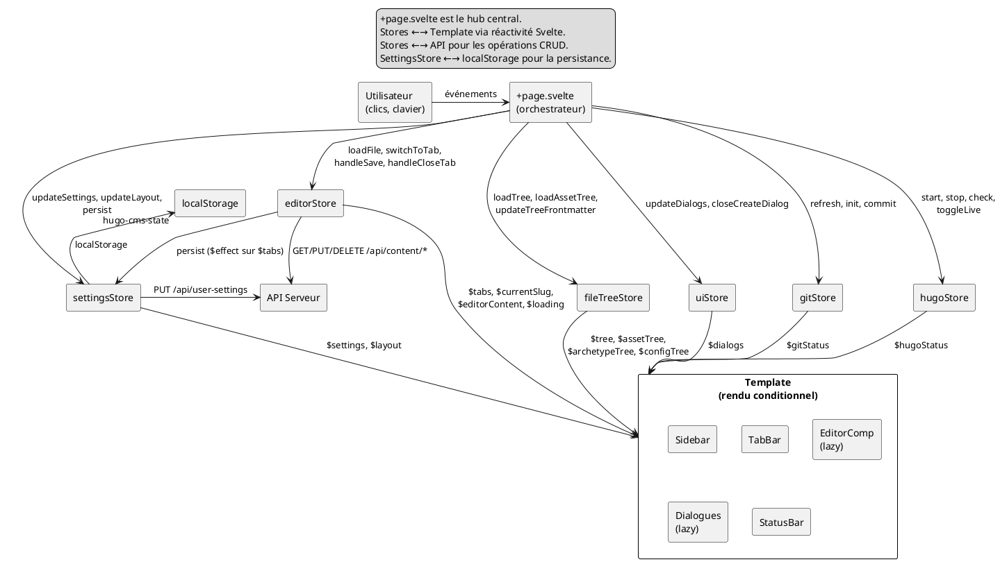

# Page Dataflow (+page.svelte)

## Role

`+page.svelte` est l'orchestrateur unique de l'application. Il ne fait pas de
logique métier lourde — il *connecte* les stores, les composants, et les
événements utilisateur. C'est le *hub* central du flux de données.

```
Événement utilisateur
  → handler dans +page.svelte
  → store method
  → template réactif
  → composant enfant
  → API serveur (si nécessaire)
  → mise à jour store
  → re-rendu template
```

---

## Data Flow

### Entrées (inputs)

| Source | Mécanisme | Exemples |
|--------|-----------|----------|
| Clic utilisateur | `onclick`, `onmousedown` dans le template | Sidebar click, TabBar close, toolbar buttons |
| Clavier | `document.addEventListener('keydown', ...)` dans `onMount` | Ctrl+P (search), Ctrl+R (raw toggle) |
| Démarrage | `onMount` → `getServerConfig()` → `restoreAppState()` | Hydratation tabs + settings |
| Externe (serveur) | Conflict polling (`setInterval`), visibility change | `reloadFileFromDisk` après conflit |
| Store réactif | `$effect` sur les stores Svelte | `$tabs`, `$currentSlug`, `$dialogs.*` |

### Sorties (outputs)

| Destination | Mécanisme | Exemples |
|-------------|-----------|----------|
| Composants enfants | Props Svelte | `content={$editorContent}`, `rawMode={$settings.defaultRawMode}` |
| Stores | Store methods | `editorStore.switchToTab()`, `settingsStore.updateLayout()` |
| API serveur | `fetch()` (via stores) | `PUT /api/content`, `DELETE /api/content` |
| localStorage | `settingsStore.persist()` | Sauvegarde tabs + layout + settings |
| DOM global | `settingsStore.applyTheme()` | `data-theme` sur `<html>` |

### Flux type : sidebar click → éditeur

```
1. Clic sur TreeNode.svelte
2. TreeNode → onLoadFile(slug) → +page.svelte.loadFile(slug)
3. loadFile → editorStore.loadFile(slug, loadTree)
4. editorStore.loadFile:
   a. Fetch GET /api/content/{slug} → body + frontmatter + mtimeMs
   b. tabs.update([...t, tab])  → nouveau tab dans le store
   c. switchToTab(slug)
5. editorStore.switchToTab:
   a. Si _editorGetContent existe : sauvegarde contenu courant dans tab sortant
   b. currentSlug.set(tab.slug)
   c. editorContent.set(tab.content)    → reactive
   d. currentFrontmatter.set(tab.frontmatter)
   e. currentFmFormat.set(tab.frontmatterLanguage)
6. Template réactif :
   - EditorComp reçoit content={$editorContent}  → Editor.svelte s'update
   - TabBar reçoit activeSlug={$currentSlug}      → highlight change
   - Sidebar reçoit currentSlug={$currentSlug}    → sélection change
```

---

## Component Tree

```
+page.svelte
├── header.app-header
│   └── logo + titre
├── restart-banner (si $dialogs.showRestartBanner)
├── setup-overlay (si !siteValid)
├── div.action-bar
│   ├── boutons gauche (toggle sidebar)
│   ├── boutons centre (search, new file, preview, console, git…)
│   └── boutons droit (hugo status, settings…)
├── div.app-body
│   ├── sidebar-wrap (si $layout.sidebarOpen)
│   │   ├── GitSidebarComp (si $layout.showGit)
│   │   └── Sidebar (sinon)
│   ├── resize-handle (sidebar)
│   └── main.editor-panel
│       ├── TabBar (si tabs.length > 0)
│       └── div.editor-panel-body
│           ├── div.editor-panel-content
│           │   ├── ArchetypeViewComp (kind === 'archetype')
│           │   ├── ConfigViewComp (kind === 'config')
│           │   ├── SitemapView (si showSitemap && !currentSlug)
│           │   ├── empty-state (si !currentSlug)
│           │   ├── ImageViewComp (kind === 'static')
│           │   └── Éditeur principal (kind === 'content')
│           │       ├── loading skeleton (si $loading)
│           │       ├── conflict-banner (si conflit actif)
│           │       ├── editor-header (filename + save + fm-toggle)
│           │       ├── div.editor-body
│           │       │   ├── EditorComp (dans {#key settingsKey})
│           │       │   └── FrontMatterEditor (si $layout.fmOpen)
│           │       └── StatusBar
│           └── preview-resize-handle + HugoPreviewComp (si showPreview)
├── HugoConsoleComp (si $layout.showConsole)
├── CreateFileDialogComp (si showCreateDialog)
├── CreateFolderDialogComp (si showCreateFolderDialog)
├── SearchDialogComp (si showSearch)
├── ShortcutsHelpComp (si showShortcuts)
├── CommitDialogComp (si showCommitDialog)
├── SettingsDialogComp (si showSettings)
└── NewSiteDialogComp (si showNewSiteDialog)
```

### Règles de rendu conditionnel

1. **Un seul panneau d'édition à la fois** : archetype OU config OU sitemap OU
   empty OU image OU éditeur de contenu. Le `{:else if}` chaîné garantit
   l'exclusivité.
2. **Sidebar ou GitSidebar** : mutuellement exclusifs (même slot dans
   `sidebar-wrap`). `showGit` override la sidebar normale.
3. **Dialogues superposés** : tous les `{#if}` de dialogue sont en dehors de
   `.app-body` — ils flottent par-dessus tout.
4. **Preview** : à côté de l'éditeur, pas dans le conditionnel principal —
   visible simultanément.

---

## Mécanismes Clés

### 1. Lazy Loading des Composants

13 composants sont lazy-loadés. Le pattern est uniforme :

```ts
let EditorComp = $state<any>(null);           // variable d'état

// Dans onMount :
import('$lib/components/Editor.svelte').then(m => EditorComp = m.default);

// Pour les autres (déclenchés par $effect) :
$effect(() => {
  if ($dialogs.showSearch && !SearchDialogComp)
    import('$lib/components/SearchDialog.svelte').then(m => SearchDialogComp = m.default);
});
```

**Pourquoi** : réduire la taille du bundle initial. Editor.svelte (~600 lignes)
et ses dépendances (Tiptap, CodeMirror) sont lourdes — on ne les charge qu'après
le rendu initial.

**État actuel** : Editor.svelte est importé dans `onMount` (toujours, dès que
possible). Les autres sont importés à la demande quand leur condition
d'affichage devient vraie.

### 2. Persistance / Restauration d'État

**Sauvegarde** : `settingsStore.persist()` est appelée :
- À chaque changement de `settings` (via subscription directe)
- À chaque changement de `layout` (via subscription directe)
- À chaque changement de `$tabs` (via `$effect` dans `+page.svelte`)

Elle sérialise dans `localStorage["hugo-cms-state"]` :
```ts
{
  tabs: [{ slug, title, frontmatterLanguage, kind }],
  currentSlug,
  settings: { theme, defaultRawMode, … },
  sidebarOpen, sidebarView, sidebarWidth, fmOpen, …
  showPreview, showConsole, showGit,
  consoleHeight, previewWidth, expandedSlugs,
}
```

Les settings sont aussi envoyés au serveur via `PUT /api/user-settings`.

**Restauration** : `restoreAppState()` (dans `$lib/restore.ts`) :
1. `settingsStore.restoreFromLocalStorage()` → lit `localStorage`
2. Si tabs existent : `editorStore.tabs.set(restored)` + fetch contenu
3. `settingsStore.restoreFromFile()` → `GET /api/user-settings`
4. `switchToTab(activeSlug)` → hydrate l'onglet actif

**Problème résolu** : les tabs n'étaient pas persistés quand on fermait le
dernier onglet (aucune subscription à `$tabs` dans `persist`). Le fix ajoute
un `$effect(() => { $tabs; settingsStore.persist(); })` qui déclenche la
sauvegarde à chaque changement de tabs.

### 3. `{#key settingsKey}` — Recréation de l'Éditeur

Quand les settings d'affichage de l'éditeur changent (rawMode, bubbleMenu,
slashMenu, historyDepth), Editor.svelte doit être détruit et recréé avec les
nouveaux props :

```ts
if (s.defaultRawMode !== $settings.defaultRawMode || …) {
  const captured = editorStore.snapshot().editorContent;
  if (captured)
    editorStore.editorContent.set(
      captured.replace(/^(?:---|\+\+\+)[\s\S]*?(?:---|\+\+\+)\n*/, '')
    );
  settingsKey++;  // {#key settingsKey} force destruction + recreation
}
```

Le replace du frontmatter évite de passer un frontmatter périmé au nouvel
éditeur. Le contenu est ré-injecté via `editorContent.set()` → prop `content`
→ `$effect` → `editor.commands.setContent()`.

### 4. Gestion des Conflits

Deux sources de détection :
- **Polling** : toutes les N ms (configurable, défaut 5000), `startConflictPoll`
  appelle `GET /api/content/{slug}` et compare `mtimeMs`.
- **Save 409** : quand `handleSave` reçoit un 409, le serveur indique que le
  fichier a été modifié entre-temps.
- **Visibilité** : quand l'utilisateur revient sur l'onglet, un check immédiat
  est déclenché.

Le conflit est affiché via un `conflict-banner` dans le template :
```svelte
{#if $conflictSlug === $currentSlug}
  → "Recharger"  : resolveConflict('reload')  → editorStore.reloadFileFromDisk()
  → "Écraser"    : resolveConflict('overwrite') → prochain save écrase
{/if}
```

### 5. Gestion des Frontmatter

Deux entrées possibles :
- **FrontMatterEditor** (panneau latéral) : `onChange={handleFrontmatterChange}`
  → met à jour store + arbre + déclenche save debounced
- **Editor.svelte** (via prop `onFrontmatterChange`) : même logique mais sans
  le debounce save — l'autosave de l'éditeur gère la persistance

Les deux convergent vers `editorStore.handleFrontmatterChange(fm)` qui met à
jour `currentFrontmatter` + `tabs.update()` pour le tab courant.

---

## Diagramme PlantUML



---

## Responsabilités

| Rôle | Ce que fait +page.svelte | Ce qu'il NE fait PAS |
|------|--------------------------|----------------------|
| Routage | Aucun (SPA mono-page, Hugo CMS) | Navigation par URL |
| État global | Destructure les stores, orchestre les appels | Logique métier (déléguée aux stores) |
| Lazy loading | Importe les composants lourds à la demande | Gestion des bundles (Vite) |
| Persistance | Déclenche `persist()` sur changements de settings/layout/tabs | Contenu des fichiers (géré par Editor + API) |
| Conflits | Affiche le banner, délègue la résolution | Détection polling (gérée par conflict.ts) |
| Theme | Applique `data-theme` au DOM | Choix des couleurs (CSS variables) |
| Sauvegarde | Déclenche save via `saveRequest++` | Écriture fichier (API serveur) |
| Resize | Wiring des handlers de redimensionnement | Calcul des positions (resize.ts) |

---

## État actuel

### Persistance tabs ✅
- `$effect(() => { $tabs; settingsStore.persist(); })` ajouté (l.103-106)
- Les tabs sont maintenant persistés quand le dernier onglet est fermé
- Au refresh, `restoreFromLocalStorage()` voit `tabs: []` → ne restaure rien

### Lazy mount Editor ✅
- `import('Editor.svelte')` dans `onMount` (l.146)
- `$effect` sur `$currentTab?.kind` pour les autres composants (l.184-186)
- Lazy loading non-bloquant : le template montre un skeleton pendant le chargement

### `{#key settingsKey}` ✅
- Incrémenté dans `onSave` de `SettingsDialogComp` (l.690-694)
- Déclenche destruction + recreation de Editor.svelte avec nouveaux props

### À surveiller

| Point | Risque | Note |
|-------|--------|------|
| `$effect` sur `$tabs` appelle `persist()` à chaque changement | Performance : sérialisation JSON + localStorage + PUT API | `persist()` a un try/catch et batch les writes — acceptable |
| 13 composants lazy-loadés avec 13 `$effect` | Lisibilité, maintenance | Pattern uniforme, facile à étendre |
| Frontmatter change avec deux chemins (debounce vs autosave) | Double écriture possible | Les deux convergent vers `handleFrontmatterChange` qui est synchrone ; le save est dedupé par `saveVersion` dans Editor |
| `settingsKey++` strip le frontmatter du contenu | Perte de frontmatter si l'éditeur avait des changements non sauvegardés | `snapshot()` capture l'état courant — le frontmatter est ré-appliqué via les props |

---

## Fichiers

| Fichier | Rôle |
|---------|------|
| `src/routes/+page.svelte` | Orchestrateur principal (1367 lignes) |
| `src/lib/restore.ts` | Logique de restauration d'état au démarrage |
| `src/lib/stores/editor.svelte.ts` | Store de l'éditeur (tabs, currentSlug, editorContent…) |
| `src/lib/stores/settings.svelte.ts` | Store des settings + layout + persistance localStorage |
| `src/lib/stores/ui.svelte.ts` | Store des dialogues (showSearch, showSettings…) |
| `src/lib/stores/fileTree.svelte.ts` | Store des arbres (content, assets, archetypes, config) |
| `src/lib/conflict.ts` | Polling et résolution des conflits de modification externe |
| `src/lib/resize.ts` | Handlers de redimensionnement des panneaux |
| `docs/architecture/editor-dataflow.md` | Dataflow détaillé Editor → Tiptap/CM6 |
