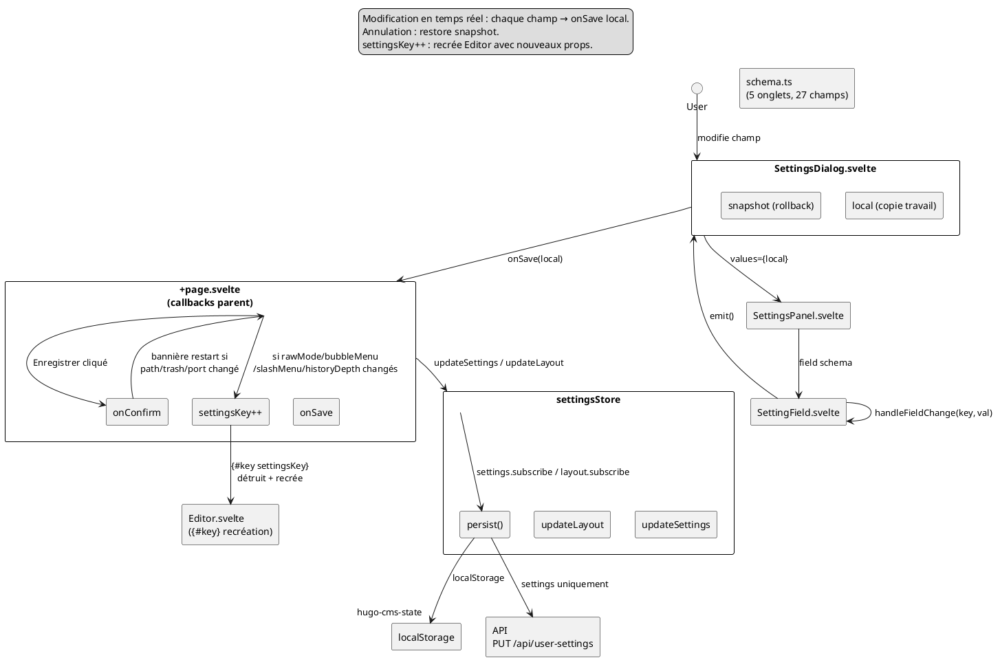

# Settings Dialog Dataflow

## Rôle

`SettingsDialog.svelte` est le panneau de configuration utilisateur. Il permet
de modifier toutes les préférences (thème, éditeur, panneaux, git, serveur) et
les propage immédiatement aux stores via `+page.svelte`.

---

## Data Flow

```
Utilisateur modifie un champ
  → handleFieldChange(key, val)
  → local[key] = val              (état local)
  → emit() → onSave(local)        (remonte au parent)
  → +page.svelte.onSave(s)
  → settingsStore.updateSettings()
    settingsStore.updateLayout()
  → persist()                     (localStorage + API)
  → si settings éditeur changés :
    settingsKey++ → {#key} recrée Editor.svelte
```

---

## Architecture des couches

```
+page.svelte
  │  $settingsData (derived store : settings + layout fusionnés)
  │  serverConfig (lecture seule, depuis API)
  │
  ├── SettingsDialog.svelte
  │     ├── local : copie de travail modifiable
  │     ├── snapshot : copie pour rollback (Annuler)
  │     │
  │     ├── SettingsPanel.svelte
  │     │     ├── Navigation par onglets (5 tabs)
  │     │     ├── Barre de recherche (filtrage champs)
  │     │     └── SettingField.svelte × N
  │     │           ├── boolean → toggle
  │     │           ├── select  → dropdown
  │     │           ├── number  → input + min/max + unité
  │     │           ├── text    → input texte
  │     │           └── folder  → input + FolderPicker
  │     │
  │     └── Boutons : Annuler → onSave(snapshot) | Enregistrer → onSave(local)
  │
  └── Callbacks parent :
        onSave(s) → updateSettings(s) + updateLayout(s)
                  → persist() → localStorage + PUT /api/user-settings
                  → si rawMode/bubbleMenu/slashMenu/historyDepth changés :
                      settingsKey++ → {#key} recrée EditorComp
        onConfirm() → vérifie si path/trash/port changé → bannière restart
```

---

## Structure des données

### SettingsData (35 propriétés, type plat)

```
SettingsData {
  theme, editorFont, editorFontSize,        // Général
  editorMaxWidth, editorMaxWidthCustom,

  defaultRawMode, showBubbleMenu,           // Éditeur
  showSlashMenu, draftByDefault,
  autoSaveDelay, historyDepth,

  sidebarOpen, sidebarWidth, sidebarView,   // Panneaux
  showFilenameInTabs,
  fmOpen, fmWidth, fmRawMode,
  showConsole, showPreview,

  showGit, gitRemote, gitBranch,            // Git

  hugoSitePathUseDotEnv,                    // Avancé
  hugoSitePathCustom,
  hugoBindAddress, hugoPort,
  cmsBindAddress, cmsPort,
  trashDir,
}
```

Ce type unique sert de contrat entre :
- `schema.ts` (définit les champs, leurs types, labels, defaults)
- `settingsData` (derived store qui fusionne `settings` + `layout`)
- `SettingsDialog` (reçoit `settings={$settingsData}`)
- `+page.svelte.onSave` (reçoit `s: SettingsData` et dispatche vers les bons stores)

En réalité, `SettingsData` est une vue plate de DEUX stores distincts :

| Store | Writable | Propriétés dans SettingsData |
|-------|----------|------------------------------|
| `settings` | `writable<SettingsState>` | theme, editorFont, …, gitBranch, hugoSitePath*, hugo*, cms*, trashDir |
| `layout` | `writable<LayoutState>` | sidebarOpen, sidebarWidth, sidebarView, fmOpen, fmWidth, fmRawMode, showConsole, showPreview, showGit |

### Schema (5 onglets, déclaratifs)

```
settingsSchema: SettingTab[]  (schema.ts)
  ├── general  (5 fields : theme, editorFont, editorFontSize, editorMaxWidth, editorMaxWidthCustom)
  ├── editor   (6 fields : defaultRawMode, showBubbleMenu, showSlashMenu, draftByDefault, autoSaveDelay, historyDepth)
  ├── panels   (9 fields : sidebarOpen/Width/View/showFilename, fmOpen/Width/RawMode, showConsole/Preview)
  ├── git      (3 fields : showGit, gitRemote, gitBranch)
  └── advanced (7 fields : hugoSitePathUseDotEnv/Custom, hugoBindAddress/Port, cmsBindAddress/Port, trashDir)
```

Chaque champ (`SettingField`) contient :
```
key, label, description?, type (select|number|text|boolean|folder),
options?, default, unit?, min?, max?, advanced?
```

---

## Cycle de vie

### 1. Ouverture

```
+page.svelte : clic bouton Settings
  → uiStore.updateDialogs({ showSettings: true })
  → $effect détecte showSettings → import SettingsDialog.svelte
  → SettingsDialogComp chargé → template affiche {#if SettingsDialogComp}
  → $effect snapshot : sauvegarde savedPathConfig, savedTrashDir, savedCmsPort
    (pour détecter les changements nécessitant restart)
```

### 2. Initialisation des données locales

```ts
$effect(() => {
    if (show) {
        local = { ...settings };      // copie de travail
        snapshot = { ...settings };   // pour rollback
    }
});
```

### 3. Modification d'un champ

```ts
function handleFieldChange(key: string, val: any) {
    (local as any)[key] = val;
    emit();  // → onSave(local)
}
```

`onSave(local)` est appelé à CHAQUE modification — pas besoin de cliquer
"Enregistrer" pour que le changement prenne effet.

### 4. Sauvegarde ("Enregistrer")

```ts
function handleSave() {
    onSave(local);        // mêmes updates que via emit()
    onConfirm?.();        // vérifications post-save
    onClose();            // ferme le dialog
}
```

### 5. Annulation

```ts
function handleCancel() {
    onSave(snapshot);     // restore les valeurs d'origine
    onClose();
}
```

---

## Callbacks parent (dans +page.svelte)

### `onSave(s)` (lignes 689-729)

```ts
onSave={(s) => {
    // 1. Si settings éditeur changent → recrée Editor
    if (s.defaultRawMode !== $settings.defaultRawMode || …) {
        const captured = editorStore.snapshot().editorContent;
        if (captured)
            editorStore.editorContent.set(
                captured.replace(/^(?:---|\+\+\+)[\s\S]*?(?:---|\+\+\+)\n*/, '')
            );
        settingsKey++;  // {#key} détruit/recrée EditorComp
    }

    // 2. Applique aux stores
    settingsStore.updateSettings({ … });  // 22 propriétés
    settingsStore.updateLayout({ … });    // 8 propriétés
}}
```

### `onConfirm()` (lignes 680-688)

```ts
onConfirm={() => {
    if (!siteValid) {
        setTimeout(() => window.location.reload(), 200);
        return;
    }
    if (hugoSitePath changé || trashDir changé || cmsPort changé) {
        uiStore.updateDialogs({ showRestartBanner: true });
    }
}}
```

---

## Schéma récapitulatif



---

## Responsabilités

| Composant | Rôle | Ne fait PAS |
|-----------|------|-------------|
| `SettingsDialog.svelte` | État local (local/snapshot), routage des événements | Rendu des champs |
| `SettingsPanel.svelte` | Navigation onglets, recherche, filtrage | Logique métier |
| `SettingField.svelte` | Rendu individuel par type | Persistance |
| `schema.ts` | Définition déclarative des 27 champs | Exécution |
| `defaults.ts` | Valeurs par défaut partagées | Stockage |
| `settings.svelte.ts` | Store settings + layout + persist | Interface utilisateur |
| `+page.svelte` | Dispatche les updates vers les bons stores, gère settingsKey | Validation |

---

## Invariants

1. **`local` et `snapshot` sont des shallow copies** — SettingsData est un objet
   plat, le spread operator suffit.

2. **`onSave(local)` est appelé à chaque modification de champ** — pas de
   validation différée. Le dialog écrit en temps réel dans les stores.

3. **`onSave` et `onConfirm` sont deux callbacks distincts** — `onSave` gère les
   updates stores, `onConfirm` gère les vérifications post-save (bannière
   restart). Les deux sont appelés depuis `handleSave()`.

4. **`settingsKey` n'est incrémenté que si 4 settings spécifiques changent** —
   `defaultRawMode`, `showBubbleMenu`, `showSlashMenu`, `historyDepth`. Ce sont
   les seuls qui nécessitent une recréation de l'éditeur Tiptap.

5. **Le frontmatter est stripé du contavant la recréation** — pour éviter de
   passer un frontmatter périmé au nouvel éditeur via `editorContent.set()`.

---

## État actuel

- `SettingsDialog.svelte` : 196 lignes, propre et lisible
- `schema.ts` : 344 lignes, déclaratif
- 27 champs dans 5 onglets, 5 types de champs
- `onSave` temps réel — pas de bouton "Appliquer" nécessaire
- `handleCancel()` restore depuis `snapshot` — pas de confirmation "Abandonner les changements ?"

### À noter

| Point | Détail |
|-------|--------|
| Doublon defaults | `local` et `snapshot` sont initialisés avec les defaults codés en dur (l.17-18), mais le `$effect` à l'ouverture (l.20-25) les écrase avec les vrais `settings` — les defaults ne servent que de fallback |
| `onSave` temps réel | Chaque champ modifié déclenche `persist()` → localStorage + API. Acceptable, mais pourrait être optimisé avec un debounce |
| `onConfirm` vide si aucun changement path/trash/port | Le callback existe toujours, mais ne fait rien dans la majorité des cas |
| settingsKey frontmatter strip | La regex `replace(/^(?:---|\+\+\+)[\s\S]*?(?:---|\+\+\+)\n*/, '')` supprime le frontmatter avant recréation. Fonctionnel mais fragile — si le format change, le strip rate |

---

## Fichiers

| Fichier | Lignes | Rôle |
|---------|--------|------|
| `src/lib/components/SettingsDialog.svelte` | 196 | Dialog modal, état local, routage |
| `src/lib/settings/SettingsPanel.svelte` | ~120 | Onglets, recherche, filtrage |
| `src/lib/settings/SettingField.svelte` | ~110 | Rendu par type de champ |
| `src/lib/settings/schema.ts` | 344 | Définition des 5 onglets, 27 champs |
| `src/lib/settings/defaults.ts` | ~20 | Valeurs par défaut partagées serveur |
| `src/lib/stores/settings.svelte.ts` | 315 | Store settings/layout, derived settingsData, persist |
| `src/lib/client-config.ts` | ~30 | ServerConfig (lecture seule dans l'onglet Avancé) |
| `src/routes/+page.svelte` | 1367 | Parent : onSave, onConfirm, settingsKey |
