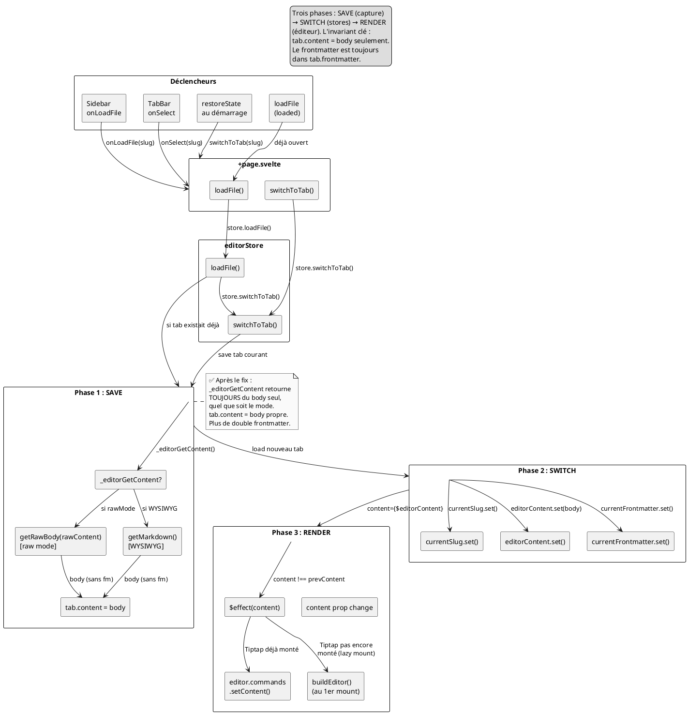

# Tab Switch Dataflow

## Déclencheurs

| Entrée | Code | Chemin |
|--------|------|--------|
| Clic fichier dans Sidebar | `onLoadFile(slug)` | `+page.svelte.loadFile()` → `editorStore.loadFile()` → `switchToTab()` |
| Clic TabBar | `onSelect(slug)` | `+page.svelte.switchToTab()` → `editorStore.switchToTab()` |
| Restauration démarrage | `restoreAppState()` | → `switchToTab(activeSlug)` |
| Clic fichier déjà ouvert | `loadFile()` détecte `existing` | → `switchToTab(slug)` directement |

---

## Les 3 phases

Chaque changement d'onglet suit exactement 3 phases, dans l'ordre :

### Phase 1 — SAVE (sauvegarde du tab sortant)

```ts
// editor.svelte.ts:128-136
if (tab.kind === 'content') {
    if (_editorGetContent) {
        const savedContent = _editorGetContent();  // ← closure Editor.svelte
        const savedFm = { ...get(currentFrontmatter) };
        tabs.update(t => t.map(ti =>
            ti.slug === curSlug && ti.kind === 'content'
                ? { ...ti, content: savedContent, frontmatter: savedFm }
                : ti
        ));
    }
```

La closure `_editorGetContent` est enregistrée dans `Editor.svelte:256` :

```ts
// Editor.svelte — dans onMount
getContent?.(() => rawMode ? getRawBody(rawContent) : getMarkdown());
//                          ^^^^^^^^^^^^^^^^^^^^^^^
//   getRawBody(rawContent) = body extrait via splitRawContent()
//   getMarkdown()          = body depuis Tiptap
```

**Invariant** : `savedContent` est **toujours du body seul**, sans frontmatter.
`getRawBody()` utilise `splitRawContent()` qui détecte YAML (`---...---`) et TOML
(`+++...+++`), extrait le body, et retourne le reste.

⚠️ **Avant le fix** (commit en cours) : en rawMode, `_editorGetContent` retournait
`rawContent` (frontmatter + body) → `tab.content` contenait le frontmatter →
au retour sur l'onglet, le `$effect(content)` le re-prépenait → **double frontmatter**.

✅ **Après le fix** : `getRawBody(rawContent)` extrait le body seul → plus
jamais de frontmatter dans `tab.content`.

### Phase 2 — SWITCH (mise à jour des stores)

```ts
// editor.svelte.ts:138-141
currentSlug.set(tab.slug);
editorContent.set(tab.content);   // ← body seulement
currentFrontmatter.set({ ...tab.frontmatter });
currentFmFormat.set(tab.frontmatterLanguage ?? 'yaml');
```

Le store `editorContent` est mis à jour avec `tab.content` = body. Les stores
`currentFrontmatter` et `currentFmFormat` portent les métadonnées.

C'est la seule phase qui modifie les stores — elle déclenche les réactivations
Svelte.

### Phase 3 — RENDER (mise à jour de l'éditeur)

#### Cas A : Tiptap déjà monté

```ts
// Editor.svelte:279-291
$effect(() => {
    if (content === prevContent) return;
    prevContent = content;
    if (rawMode) {
        // Fusion frontmatter + body → rawContent
        const fmString = serializeFm(frontmatter, frontmatterFormat);
        const newContent = fmString ? `${fmString}\n\n${content}` : content;
        if (rawContent !== newContent) rawContent = newContent;
    } else if (editor) {
        editor.commands.setContent(protectShortcodes(content));  // ← body dans Tiptap
    }
});
```

- **En WYSIWYG** : `editor.commands.setContent(body)` → Tiptap met à jour le contenu
- **En rawMode** : `serializeFm()` + body = `rawContent` → la sync `$effect` (l.395)
  pousse `rawContent` dans CM6

#### Cas B : Lazy mount (Editor pas encore chargé)

```ts
// Editor.svelte:243-254 (onMount)
if (!rawMode) {
    buildEditor(content);  // ← lit le content prop déjà à jour
}
prevContent = content;
```

Le `content` prop a déjà été set par `editorContent.set()` en Phase 2. Au
montage, `buildEditor(content)` initialise Tiptap avec le bon body. Le
`$effect(content)` qui suit skip grâce au guard `prevContent`.

---

## Diagramme



---

## Cas particuliers

### 1. Même onglet (click sur l'onglet actif)

```ts
if (_editorGetContent) {
    // tab.slug === curSlug → tabs.update modifie le MÊME tab
    // → tab.content est périmé (pointe vers l'ancien objet)
}
editorContent.set(tab.content);  // ← tab.content = ancienne valeur
```

Quand on clique sur l'onglet déjà actif, `tabs.update` crée une nouvelle
référence pour le tab, mais la variable `tab` dans `switchToTab` pointe encore
vers l'ancienne. `editorContent.set(tab.content)` set la valeur **avant** la
sauvegarde — mais comme c'est le même onglet, le guard `content === prevContent`
du `$effect` skip la mise à jour. Pas de bug visible, mais pas utile non plus.

**Recommandation** : `if (slug === get(currentSlug)) return;` en début de
`switchToTab` — no-op.

### 2. Fermeture d'onglet (handleCloseTab)

```ts
// editor.svelte.ts:185-198
if (get(currentSlug) === slug) {
    editorContent.set(nextTab.content);
    currentFrontmatter.set({ ...nextTab.frontmatter });
}
```

`handleCloseTab` ne passe **pas** par `_editorGetContent` — le contenu de l'onglet
fermé n'est pas sauvé. C'est un choix délibéré : si l'utilisateur ferme un onglet,
les changements non-sauvegardés sont perdus (comme dans un IDE classique).

### 3. Reload depuis disque (reloadFileFromDisk)

```ts
// editor.svelte.ts:315-319
if (get(currentSlug) === slug) {
    editorContent.set(body);
    currentFrontmatter.set({ ...frontmatter });
}
```

Pareil — pas de save via `_editorGetContent`. Le contenu courant est écrasé par
les données fraîches du serveur. L'utilisateur a choisi "Recharger" dans le
banner de conflit, il sait qu'il perd ses changements locaux.

---

## Invariants

1. **`tab.content` contient toujours le body seul, jamais le frontmatter**
   - Vérifié à la création (depuis `data.body` de l'API)
   - Vérifié au reload depuis disque (`data.body`)
   - ✅ Vérifié au save via `_editorGetContent` (fix appliqué)
   - Le frontmatter double ne peut plus arriver

2. **Le frontmatter est toujours dans `tab.frontmatter`**
   - Mis à jour via `handleFrontmatterChange` → `currentFrontmatter` → `tabs.update`
   - Jamais dans `tab.content`

3. **`editorContent` store = body seulement**
   - `editorContent.set(tab.content)` en Phase 2
   - `$effect(content)` en WYSIWYG : `editor.commands.setContent(body)`
   - `$effect(content)` en raw : `serializeFm(fm) + "\n\n" + content` → fusion correcte

4. **La reconstruction de Tiptap (`buildEditor`) n'arrive qu'au mount**
   - Plus jamais appelée depuis les store methods (depuis les refactors précédents)
   - `_editorSetContent` est gardé comme infrastructure mais pas appelé dans le flux normal

---

## Fichiers

| Fichier | Lignes | Rôle |
|---------|--------|------|
| `src/lib/stores/editor.svelte.ts` | 123-148 | `switchToTab()` : SAVE + SWITCH |
| `src/lib/stores/editor.svelte.ts` | 83-105 | `loadFile()` : fetch API + switch |
| `src/lib/components/Editor.svelte` | 256 | `getContent` closure avec `getRawBody` |
| `src/lib/components/Editor.svelte` | 279-291 | `$effect(content)` : RENDER phase |
| `src/lib/components/Editor.svelte` | 192-241 | `buildEditor()` : création Tiptap |
| `src/lib/components/Editor.svelte` | 243-271 | `onMount` : enregistrement callbacks |
| `src/routes/+page.svelte` | 199-216 | `loadFile()` et `switchToTab()` wrapper |
